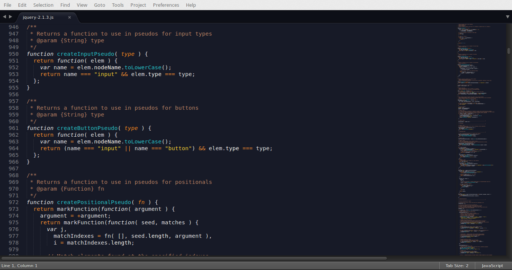

## Two Stones color scheme

Two Stones is a color scheme for Sublime Text Editor was created with an emphasis on being easy on the eyes with crisp and clear contrast.

### Installation

You can install it using the excellent ColorSublime plugin

https://github.com/Colorsublime/Colorsublime-Plugin

### HTML / CSS

### Ruby

### PHP

### Javascript

